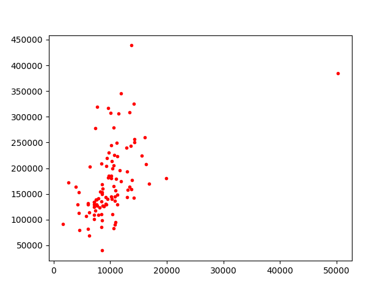
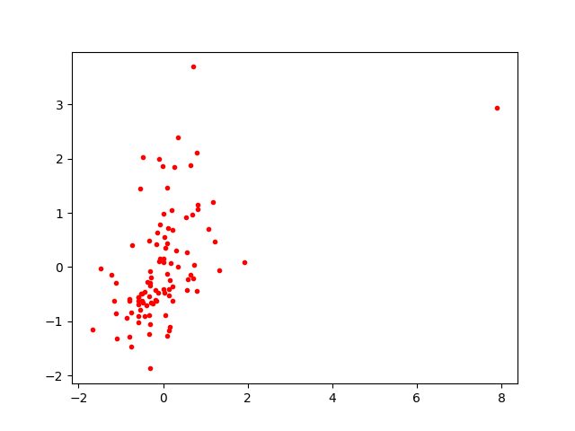
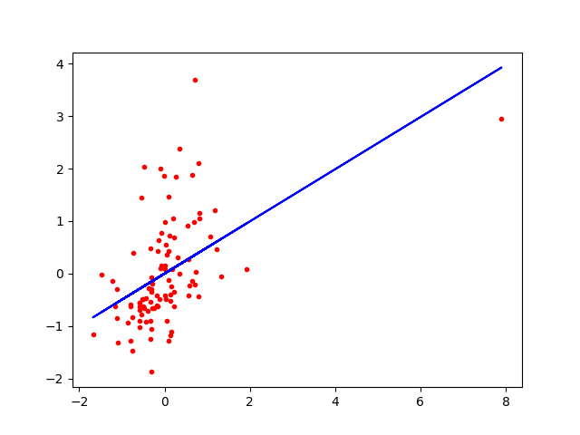

# PySLR

Python Simple Linear Regression

# Introduction

Hi ! My name is Cesumilo, and this little project talk about Simple Linear Regression in Python. It has been made during a workshop at my school laboratory called "Epitech Hub Innovation".

# Dataset

I've tested this little regression on a traditional set of data about House Sale Price prediction. There is a little dataset provided by Kaggle inside the repository.

# Sample of 100 examples

> Visualization of Data

> Visualization of Normalized Data

> Fitted line on Normalized Data
